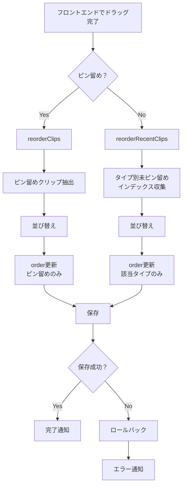

# バックエンド実装計画：カルーセルD&D・Expand機能

## 1. 現在の実装状況サマリー

### 完了済みフロントエンド実装
- [x] カルーセルアイテムの固定サイズ（220px × 240px）: `webview/src/styles.css` で実装済み
- [x] 「Expand」ボタン: `ClipCard.tsx` に実装済み、バックエンドの `_openClip` で全タイプ対応済み
- [x] カルーセル内ドラッグアンドロップ: `Deck.tsx` に実装済み
- [x] ドラッグハンドル（☰）: `ClipCard.tsx` に表示済み
- [x] タイプ別カルーセルのドラッグアンドロップ: バックエンド `_reorderRecentClips` 実装済み

### バックエンド実装状況
- `DnDService.reorderClips`: ピン留めクリップの並び替え（要修正）
- `SidebarProvider._reorderRecentClips`: タイプ別未ピン留めクリップの並び替え（要修正）
- `SidebarProvider._openClip`: Expand機能のバックエンド処理（実装済み）

## 2. 検証で判明した問題点

### 2.1 orderフィールド更新ロジックの不備
**問題**:
- `DnDService.reorderClips` と `_reorderRecentClips` の両方で、全クリップの `order` を再採番している
- ピン留めクリップと未ピン留めクリップの順序が混在する可能性がある

**影響**:
- ピン留めセクションとRecentセクションの表示順が意図しない動作をする
- タイプ別カルーセル内の順序が他のタイプに影響を与える

### 2.2 _reorderRecentClipsのロジック問題
**問題**:
```typescript
// 現在の実装
const targetClips = deck.clips.filter((clip: any) => clip.type === clipType && !clip.pinned);
// filterで新しい配列を作って操作
const [movedClip] = targetClips.splice(startIndex, 1);
targetClips.splice(endIndex, 0, movedClip);
// mapで置き換え
deck.clips = deck.clips.map((clip: any) => {
  if (clip.type === clipType && !clip.pinned) {
    return targetClips[targetIndex++];
  }
  return clip;
});
// 全クリップのorderを更新（問題）
let order = 0;
deck.clips.forEach((clip: any) => {
  clip.order = order++;
});
```

**修正が必要な点**:
1. `order` 更新を該当クリップのみに限定する
2. タイプ別の相対順序を保持する

### 2.3 エラーハンドリングの不足
- 保存失敗時のロールバック処理がない
- ユーザーへのエラー通知が汎用的

## 3. バックエンド実装計画

### 3.1 orderフィールド更新ロジックの修正

**目標**: ピン留めクリップと未ピン留めクリップで `order` を分離管理

**実装方針**:
1. ピン留めクリップ: `order` を 0 から連番で管理
2. 未ピン留めクリップ: `order` をタイプ別に管理、またはタイムスタンプベースの順序を保持

**修正ファイル**:
- `src/sidebar/components/dndService.ts`
- `src/sidebar/sidebarProvider.ts`

### 3.2 DnDService.reorderClipsの修正

**修正内容**:
```typescript
static reorderClips(clips: Clip[], startIndex: number, endIndex: number): Clip[] {
  // ピン留めクリップのみを抽出
  const pinnedClips = clips.filter(clip => clip.pinned);
  const unpinnedClips = clips.filter(clip => !clip.pinned);
  
  // ピン留めクリップ内での並び替え
  const [removed] = pinnedClips.splice(startIndex, 1);
  pinnedClips.splice(endIndex, 0, removed);
  
  // orderを更新（ピン留めクリップのみ）
  const updatedPinned = pinnedClips.map((clip, index) => ({
    ...clip,
    order: index
  }));
  
  // 未ピン留めクリップはorderを保持
  return [...updatedPinned, ...unpinnedClips];
}
```

### 3.3 _reorderRecentClipsの修正

**修正内容**:
```typescript
private async _reorderRecentClips(clipType: string, startIndex: number, endIndex: number) {
  try {
    const deck = await this.storageService.loadDeck();
    
    // 該当タイプの未ピン留めクリップのインデックスを収集
    const targetIndices: number[] = [];
    deck.clips.forEach((clip, index) => {
      if (clip.type === clipType && !clip.pinned) {
        targetIndices.push(index);
      }
    });
    
    if (targetIndices.length === 0) return;
    
    // 境界値チェック
    if (startIndex < 0 || startIndex >= targetIndices.length || 
        endIndex < 0 || endIndex >= targetIndices.length) {
      console.error('Invalid reorder indices:', { startIndex, endIndex, length: targetIndices.length });
      return;
    }
    
    // 実際のインデックスを取得
    const actualStartIndex = targetIndices[startIndex];
    const actualEndIndex = targetIndices[endIndex];
    
    // クリップを移動
    const [movedClip] = deck.clips.splice(actualStartIndex, 1);
    deck.clips.splice(actualEndIndex, 0, movedClip);
    
    // 該当タイプの未ピン留めクリップのorderのみ更新
    let order = 0;
    deck.clips.forEach((clip) => {
      if (clip.type === clipType && !clip.pinned) {
        clip.order = order++;
      }
    });
    
    await this.storageService.saveDeck(deck);
    console.log(`Reordered recent clips of type ${clipType}: moved from ${startIndex} to ${endIndex}`);
  } catch (error) {
    console.error('Failed to reorder recent clips:', error);
    vscode.window.showErrorMessage(`Failed to reorder clips: ${error}`);
  }
}
```

### 3.4 エラーハンドリングの強化

**修正内容**:
1. 保存前にデッキのバックアップを取得
2. 保存失敗時にバックアップから復元
3. より詳細なエラーメッセージをユーザーに通知

**修正ファイル**:
- `src/sidebar/sidebarProvider.ts`

### 3.5 単体テストの追加

**テスト項目**:
1. `DnDService.reorderClips`:
   - 正常系: ピン留めクリップの並び替え
   - 境界値: 先頭・末尾への移動
   - 異常系: 範囲外インデックス

2. `SidebarProvider._reorderRecentClips`:
   - 正常系: タイプ別未ピン留めクリップの並び替え
   - 境界値: 1要素の場合、空配列の場合
   - 異常系: 存在しないタイプ

**テストファイル**:
- `src/__tests__/dndService.test.ts`

### 3.6 デバッグログの追加

**追加箇所**:
- `_reorderClips`: 開始・完了・エラー時
- `_reorderRecentClips`: 開始・完了・エラー時
- `_openClip`: クリップタイプ・成功・失敗時

### 3.7 不要なdeck更新の最適化

**修正内容**:
- ドラッグ中は `_refreshDeck` を呼ばない
- ドラッグ完了時のみ更新するようフロントエンドと連携（バックエンドは既に完了時のみ更新されていることを確認）

## 4. 実装順序

1. [ ] `DnDService.reorderClips` の修正
2. [ ] `_reorderRecentClips` の修正
3. [ ] エラーハンドリングの強化
4. [ ] デバッグログの追加
5. [ ] 単体テストの追加
6. [ ] Expand機能の動作確認（dataframe・textタイプ）

## 5. テスト計画

### 5.1 手動テスト項目
1. ピン留めクリップのドラッグアンドロップ
2. タイプ別カルーセル内のドラッグアンドロップ
3. Expandボタンでの全タイプの拡大表示
4. エラー時の動作（保存失敗シミュレーション）

### 5.2 自動テスト項目
- `src/__tests__/dndService.test.ts` にテストケースを追加

## 6. 成果物

1. 修正済み `src/sidebar/components/dndService.ts`
2. 修正済み `src/sidebar/sidebarProvider.ts`
3. 新規 `src/__tests__/dndService.test.ts`
4. 動作確認済みのバックエンド実装

## 7. Mermaid図：修正後の並び替えフロー



## 8. 注意事項

- フロントエンドのドラッグハンドル動作は別途対応が必要（本計画外）
- 既存データの `order` フィールドは移行処理が必要な場合がある
- パフォーマンスへの影響を考慮し、デッキサイズが大きい場合のテストを実施する
