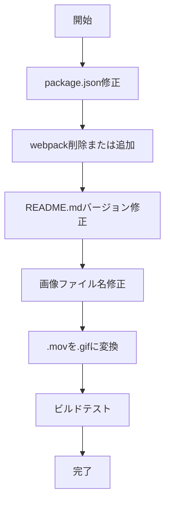

# DataDeck Marketplace公開に向けた修正計画書

## 1. 検出された問題一覧

### 🔴 高優先度（公開前に修正必須）

| # | カテゴリ | 問題 | 影響 |
|---|---------|------|------|
| 1 | **package.json** | webpackスクリプトが定義されているが、webpackがdevDependenciesに存在しない | `npm run webpack`実行時にエラー |
| 2 | **README.md** | バッジでv1.0.0と記載されているが、package.jsonはv1.0.2 | バージョン情報の不整合 |
| 3 | **画像ファイル** | `.mov`形式を使用（Marketplaceは`.gif`/`.png`を推奨） | デモが正しく表示されない可能性 |
| 4 | **画像ファイル** | `DetaDeck-icon.png`のファイル名が`DataDeck`ではない（タイプミス） | アイコン読み込み失敗の原因 |

### 🟡 中優先度（公開前に修正推奨）

| # | カテゴリ | 問題 | 影響 |
|---|---------|------|------|
| 5 | **webview/package-lock.json** | 1809行のファイルがコミットされている | リポジトリサイズ増加、`.gitignore`への追加を検討 |
| 6 | **Banner画像** | `DataDeck-Banner.png`の尺寸がMarketplace推奨（920x240px）に適合するか未確認 | Marketplace表示品質 |

---

## 2. 修正アクションプラン

### Phase 1: 即座に修正（Codeモードで実行）



#### 修正1: package.json - webpackスクリプトの削除

**理由**: webpackは使用されておらず、Viteで代替されている

```diff
  "scripts": {
    "vscode:prepublish": "npm run compile",
    "compile": "tsc -p ./tsconfig.json",
    "watch": "tsc -watch -p ./tsconfig.json",
-   "webpack": "webpack --mode development",
-   "webpack:prod": "webpack --mode production",
    "webview:dev": "cd webview && npm run dev",
    "webview:build": "cd webview && npm run build",
    "test": "jest",
    "build": "npm run compile && npm run webview:build",
    "package": "npm run build && npx vsce package",
    "publish": "npm run build && npx vsce publish"
  },
```

#### 修正2: README.md - バージョン番号の統一

**変更箇所**:
- バッジのバージョン: `1.0.0` → `1.0.2`
- インストール手順の例: `datadeck-1.0.0.vsix` → `datadeck-1.0.2.vsix`

#### 修正3: 画像ファイルの改名

```bash
# タイプミス修正
mv docs/images/DetaDeck-icon.png docs/images/DataDeck-icon.png
```

#### 修正4: デモ画像の形式変換

```bash
# .mov → .gif への変換（ImageMagick等を使用）
# 例: convert input.mov -resize 640x360 -fps 10 output.gif
```

---

### Phase 2: 確認・検証（Codeモードで実行）

| # | アクション | 確認内容 |
|---|-----------|---------|
| 1 | Banner画像尺寸確認 | 920x240px以上あるか確認 |
| 2 | ビルドテスト実行 | `npm run build` が成功すること |
| 3 | パッケージ生成テスト | `npm run package` が成功すること |
| 4 | vsixインストール確認 | 生成されたvsixが正常にインストールできること |

---

## 3. 修正後のチェックリスト

### 公開前必須チェック
- [ ] `npm run build` 成功確認
- [ ] `npm run package` でvsix生成成功
- [ ] README.mdのバージョン番号がpackage.jsonと一致
- [ ] 画像ファイル名が正しい（DataDeck-icon.png）
- [ ] デモ画像が.gif/.png形式

### Marketplace公開チェック
- [ ] publisher名確認（package.jsonの"datadeck"）
- [ ] Banner画像尺寸確認（920x240px推奨）
- [ ] アイコン品質確認（128x128px以上）
- [ ] `npm run publish` 実行 または 手動アップロード

---

## 4. 次のステップ

1. **Codeモードに切り替え**: 上記の修正を実行
2. **ビルド・パッケージテスト**: 修正後の動作確認
3. **Marketplace公開**: 問題なければ公開手続きへ

---

## 5. 関連ファイル

- 修正対象: [`package.json`](package.json)
- 修正対象: [`README.md`](README.md)
- 修正対象: `docs/images/DetaDeck-icon.png` → `docs/images/DataDeck-icon.png`
- 修正対象: `docs/images/*.mov` → `docs/images/*.gif`